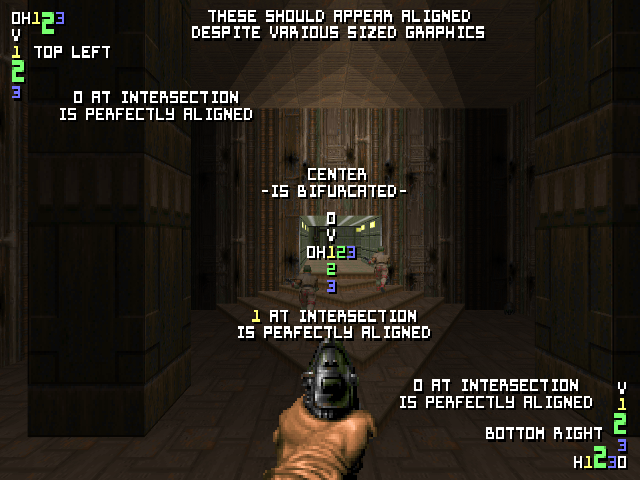
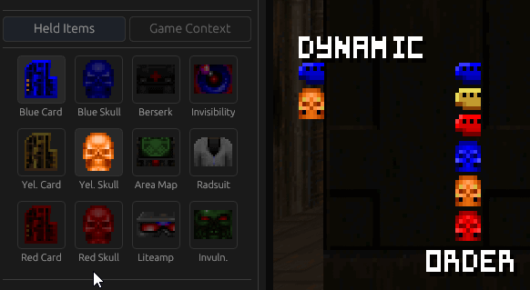
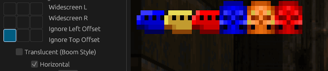

Compliance Tests and References
---

This document aims to ensure consistent implementation of SBARDEF features across compliant source ports by way of references, visual examples, and tests.

---

# `List`

This document provides reference materials and test cases to ensure consistent implementation of the `list` element across ID24-compliant source ports.

## Test Case

To verify compliance, load the **[ListAlignmentTest.zip](./tests/ListAlignmentTest.zip)** package in your source port.

## Dynamic Behavior (Conditional Reflow)
The `list` element must dynamically recalculate the stack when children are hidden by way of `conditions` not passing.

| Dynamic Order Example | Alignment Inheritence Example |
| :---: | :---: |
|  |  |
| *No gaps when items are toggled.* | *Take note at the skull key graphics taller height and how the list's drawing aligns them based on the list's `alignment` state.* |

---

More to come.
