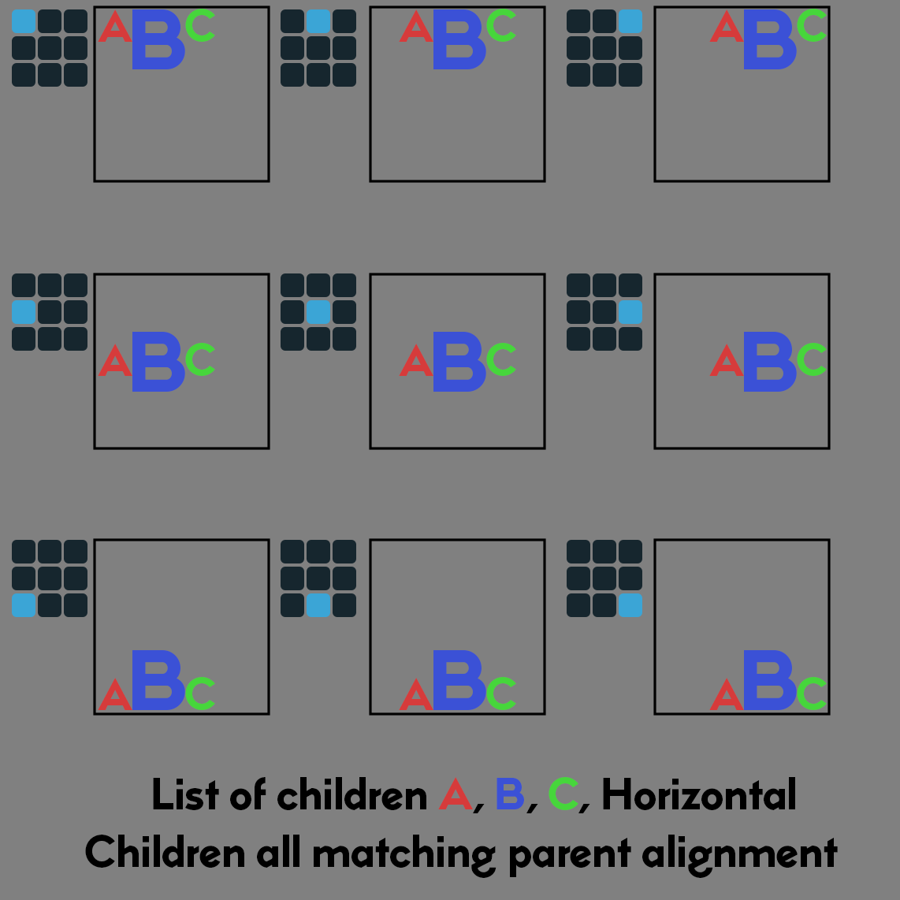

## JSON lump
The version has been updated to "1.2.0".

## Selecting status bars to render
Support unlimited number of `statusbar` definitions.

## HUD fonts
The Doom HUD font contains a total of 95 glyphs, which represent the ASCII characters from `!` to `_` .

`root`
| Name | Type | Description
|--|--|--|
| `hudfonts` | array of `hudfont`| An array of HUD fonts. Must not be null; must contain at least one entry.

`hudfont`
| Name | Type | Description
|--|--|--|
| `name` | string | An identifier used to resolve this HUD font.
| `type` | integer | One of the values matching the type enumeration described in the number font section.
| `stem` | string | A string representing the first few characters of each glyph’s name in the WAD dictionary.

## Status bar elements alignment
Alignment flags were undocumented in SBARDEF 0.99.2 spec.

`alignment`
| Flag | Description
|--|--|
| `0x00` | Horizontal left
| `0x01` | Horizontal middle
| `0x02` | Horizontal right
| `0x00` | Vertical top
| `0x04` | Vertical middle
| `0x08` | Vertical bottom
| `0x10` | Ignore left patch offset
| `0x20` | Ignore top patch offset

### New alignment flags: 
Align elements according to the widescreen layout offset.

| Flag| Description
|--|--|
| `0x40` | Move the element to the left in widescreen mode.
| `0x80` | Move the element to the right in widescreen mode.

## List of elements
A container for dynamically positioning child elements. Automatically calculates the total bounding box for all "active" child elements and arranges them sequentially in either a vertical or horizontal layout. 
Only children whose `conditions` are met are included in the layout calculation; others are skipped, and the list is recalculated to fill the gap. The end state is a dynamically arranged series of child elements with no gaps.

`list` 
| Name | Type | Description |
|--|--|--|
| `x` | integer | The virtual x position of this element.
| `y` | integer | The virtual y position of this element.
| `alignment` | bitfield | The alignment of the entire list stack relative to (x, y). Also determines the alignment of children.
| `conditions` | array of `condition`| A series of conditions to meet to render both this and all child elements.
| `children` | array of `sbarelem`| An array of child elements.
| `horizontal` | boolean | If `true`, child elements are positioned horizontally. Default: `false` (vertical).
| `spacing` | integer | The gap (in pixels) between active child elements.

<table>
<tr>
<td width="60%" valign="middle">

The `list` uses the `alignment` flags to determine how the ordered list of child elements are drawn relative to its anchor coordinate `(x, y)`. Elements are always processed in the logical order they are defined in the file's layout.

Children are automatically aligned on the axis opposite to the flow of elements to match the container's `alignment`. 
- In a **Horizontal** list, children respect `Vertical` alignment flags (e.g., if the list is `Vertical Bottom`, all children will be flush against the bottom edge of the list's total height).
- In a **Vertical** list, children respect `Horizontal` alignment flags.

Children within a `list` typically use `x: 0, y: 0`. If non-zero coordinates are provided for a child, they are treated as an additional relative offset from that child's calculated position within the sequential stack.

In short, assuming child offsets are set to `(0,0)`, if the `list` is set to "Top Right" alignment, the **top** and **right** edges of the child elements graphic patches should all be aligned, regardless of the varying dimensions of the child elements.

</td>
<td width="40%" valign="middle" align="center">

 
</td>
</tr>
</table>

---

## Element translucency
The new `translucency` boolean field enables rendering elements with a global transparency map defined by the Boom standard.

## Support for "image cropping" on graphical elements
The `graphic`, `face` and `facebg` element types can have an optional `crop` object with the following optional fields:

`crop`
| Name | Type | Description
|--|--|--|
| `width` | integer | The width, in pixels, of the crop rectangle.
| `height` | integer | The height, in pixels, of the crop rectangle.
| `left` | integer | The horizontal offset from the patch left edge to begin cropping.
| `top` | integer | The vertical offset from the patch top edge to begin cropping.
| `center` | boolean | The `left` and `top` offsets are calculated from the center of the patch.

## New number types
8 - current player’s kills  
9 - current player’s items  
10 - current player’s secrets  
11 - current player's kills percentage  
12 - current player's items percentage  
13 - current player's secrets percentage  
14 - maximum kills  
15 - maximum items  
16 - maximum secrets  
17 - current player's powerup duration for type specified by **param**  

### Powerup types
0 - invulnerability  
1 - berserk  
2 - partial invisibility  
3 - radiation shielding suit  
4 - computer area map  
5 - light amplification goggles

## New element conditions
Add new optional parameters to `condition` object:

`condition`
| Name | Type | Description
|--|--|--|
| `"condition"` | enum | The type of condition to resolve, as described by the table in the "Element conditions" section.
| `"param"` | integer | A parameter as described for each condition type.
| `"param2"` | integer | Optional parameter for some conditions.
| `"param_string"` | string | String parameter.

New conditions:
| Type | Description
|--|--|
| `19` | Whether the automap mode is equal to the flags defined by **param**.
| `20` | Whether component type is enabled defined by **param_string**.
| `21` | Whether component type is disabled defined by **param_string**.
| `22` | Whether the weapon defined by **param** is not owned.
| `23` | Whether health is greater than or equal to value defined by **param**.
| `24` | Whether health is less than the value defined by **param**.
| `25` | Whether health percentage is greater than or equal to the value defined by the **param**.
| `26` | Whether health percentage is less than the value defined by **param**.
| `27` | Whether armor is greater than or equal to value defined by **param**.
| `28` | Whether armor is less than the value defined by **param**.
| `29` | Whether armor percentage is greater than or equal to value defined by **param**.
| `30` | Whether armor percentage is less than the value defined by **param**.
| `31` | Whether selected weapon's ammo is greater than or equal to the value defined by **param**.
| `32` | Whether selected weapon's ammo is less than the value defined by **param**.
| `33` | Whether selected weapon's ammo percentage is greater than or equal to value defined by **param**.
| `34` | Whether selected weapon's ammo percentage is less than the value defined by **param**.
| `35` | Whether ammo is greater than or equal to the value defined by **param**. The ammo type is defined by **param2**.
| `36` | Whether ammo is less than the value defined by **param**. The ammo type is defined by **param2**.
| `37` | Whether ammo percentage is greater than or equal to value defined by **param**. The ammo type is defined by **param2**.
| `38` | Whether ammo percentage is less than the value defined by **param**. The ammo type is defined by **param2**.
| `39` | Whether widescreen mode is enabled or disabled defined by **param**.
| `40` | Whether current episode is equal the value defined by **param**.
| `41` | Whether current level is greater than or equal to value defined by **param**.
| `42` | Whether current level is less than value defined by **param**.
| `43` | Whether the patch is empty. The patch name is defined by the **param_string**.
| `44` | Whether the patch is not empty. The patch name is defined by the **param_string**.
| `45` | Whether kills is less than value defined by **param**.
| `46` | Whether kills is greater than or equal to value defined by **param**.
| `47` | Whether items is less than value defined by **param**.
| `48` | Whether items is greater than or equal to value defined by **param**.
| `49` | Whether secrets is less than value defined by **param**.
| `50` | Whether secrets is greater than or equal to value defined by **param**.
| `51` | Whether kills percentage is less than value defined by **param**.
| `52` | Whether kills percentage is greater than or equal to value defined by **param**.
| `53` | Whether items percentage is less than value defined by **param**.
| `54` | Whether items percentage is greater than or equal to value defined by **param**.
| `55` | Whether secrets percentage is less than value defined by **param**.
| `56` | Whether secrets percentage is greater than or equal to value defined by **param**.
| `57` | Whether remaining powerup duration is less than value defined by **param**. Powerup type defined by **param2**.
| `58` | Whether remaining powerup duration is greater than or equal to value defined by **param**. Powerup type defined by **param2**.
| `59` | Whether remaining powerup duration percentage is less than value defined by **param**. Powerup type defined by **param2**.
| `60` | Whether remaining powerup duration percentage is greater than or equal to value defined by **param**. Powerup type defined by **param2**.

Automap mode flags:
| Flag | Description
|--|--|
| `0x01` | Automap is enabled.
| `0x02` | Automap overlay is enabled.
| `0x04` | Automap is disabled.

## String element

`string`
|Name|Type|Description
|--|--|--|
| `x` | integer | The virtual x position of this element.
| `y` | integer | The virtual y position of this element.
| `alignment` | bitfield | The alignment of this element’s rendered graphics.
| `tranmap` | string | The name of a transparency map lump to resolve. Can be null.
| `translation` | string | The name of a translation to resolve. Can be null.
| `translucency` | boolean | Enable global translucency.
| `conditions` | array of `condition`| A series of conditions to meet to render both this and all child elements. Can be null; an array length of 0 is considered an error condition.
| `children` | array of `sbarelem`| An array of child elements. Can be null; an array length of 0 is considered an error condition.
| `type` | integer | One of the values matching the type enumeration described in the string types section.
| `data` | string | Custom string if `type` is 0, null otherwise.
| `font` | string | The name of the hud font to render this string with.

### String types
0 - custom string  
1 - current level title (from UMAPINFO), vanilla title if UMAPINFO is not avaible  
2 - current level label (from UMAPINFO)  
3 - current level author (from UMAPINFO)  

## Component element
The concept of a separate HUD no longer exists. All HUD elements are now defined in the SBARDEF lump, including the classic Doom "message line". HUD components always use 320x200 fullscreen virtual resolution.

`component`
| Name | Type | Description
|--|--|--|
| `type` | string | String matching the type described in the component section.
| `x` | integer | The virtual x position of this element.
| `y` | integer | The virtual y position of this element.
| `alignment` | bitfield | The alignment of this element’s rendered graphics.
| `vertical` | boolean | Optional vertical layout.
| `font` | string | The name of the `hudfont` font to render this widget with.
| `tranmap` | string | The name of a transparency map lump to resolve. Can be null.
| `translation` | string | The name of a translation to resolve. Can be null.
| `translucency` | boolean | Enable global translucency.
| `conditions` | array of `condition`| A series of conditions to meet to render both this and all child elements. Can be null; an array length of 0 is considered an error condition.
| `children` | array of `sbarelem`| An array of child elements. Can be null; an array length of 0 is considered an error condition.

### Component types
Classic Doom:
| Type | Description
|--|--|
| `"message"` | Message line
| `"level_title"` | Level title line
| `"chat"` | Multiplayer chat

From vaious source ports:
| Type | Description
|--|--|
| `"stat_totals"` | Kills/Secrets/Items totals from DSDA-Doom
| `"time"` | Level time
| `"coordinates"` | Player coordinates from Boom
| `"fps_counter"` | FPS counter
| `"render_stats"` |"IDRATE" cheat from PrBoom+
| `"command_history"` | Command history from DSDA-Doom
| `"speedometer"` | Speedometer
| `"announce_level_title"` | Level name announce line

## Carousel element
Weapon carousel HUD element compatible with Unity and KEX ports. It always use 320x200 fullscreen virtual resolution.

`carousel`
|Name|Type|Description
|--|--|--|
| `x` | integer | Ignored. Carousel element is always centered.
| `y` | integer | The virtual y position of this element.
| `alignment` | bitfield | The alignment of this element’s rendered graphics.
| `tranmap` | string | The name of a transparency map lump to resolve. Can be null.
| `translation` | string | The name of a translation to resolve. Can be null.
| `translucency` | boolean | Enable global translucency.
| `conditions` | array of `condition`| A series of conditions to meet to render both this and all child elements. Can be null; an array length of 0 is considered an error condition.
| `children` | array of `sbarelem`| An array of child elements. Can be null; an array length of 0 is considered an error condition.

## Version History

### v1.2.0
- Added the `list` container for dynamic positioning of child elements.
- Added the `string` element.
- Added new `number` types for kills, items, and secrets.
- Added new conditions for kills, items, secrets and powerups.
- Added new `number` type for powerup duration.

### v1.1.1
- Added two previously missing alignment flags that ignore patch offsets.
- Updated values for widescreen alignment flags.
- Rewrote the experimental "image cropping" feature and introduced the `crop` object.
- Clarified that HUD components always use fullscreen virtual resolution.
- Added conditions 43 and 44 to check whether a patch is empty.
- Updated conditions 20 and 21.

### v1.1.0
- Initial version.
